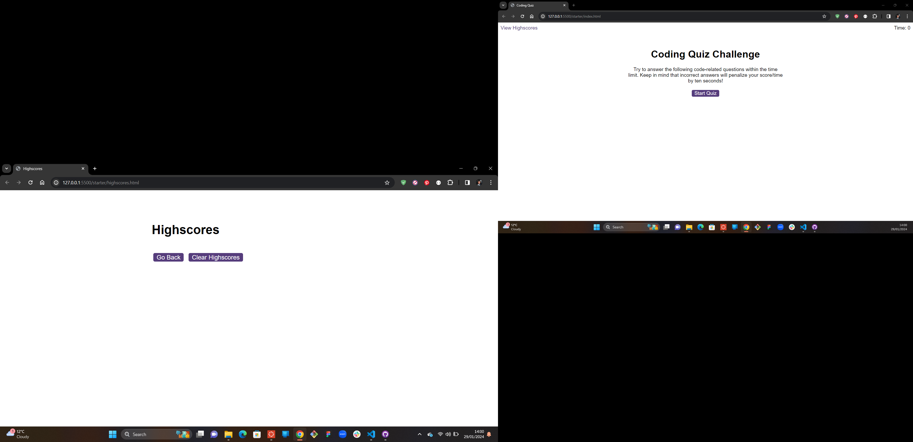
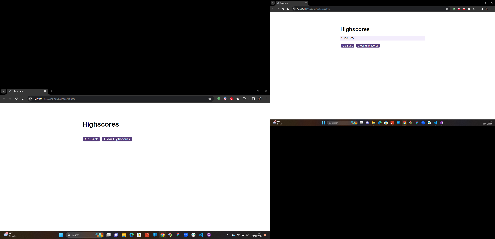
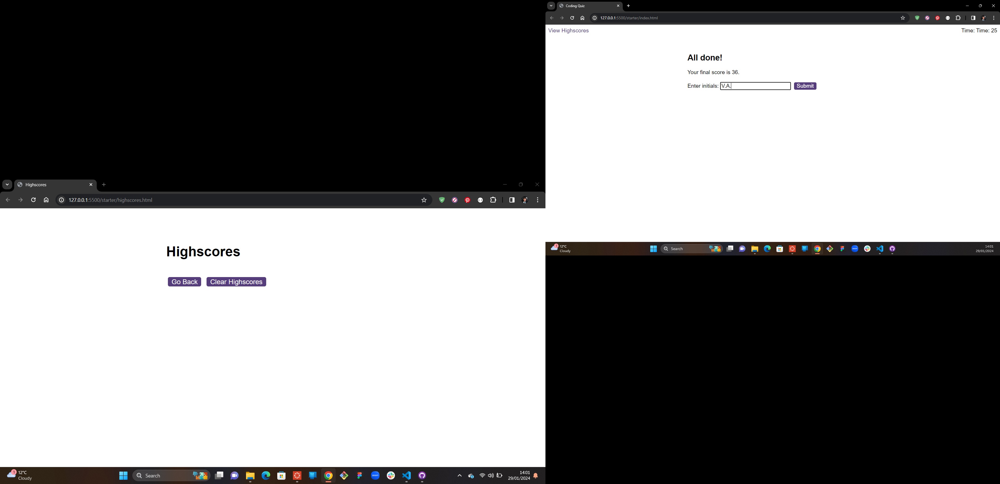

# coding-quiz
Quiz created using html, CSS and javaScript.

Created variables for all the ids in the starter html files. 
Linked the logic, questions and scores javaScripts.

Code functions created:
* Start button to begin the quiz
* Questions contain buttons for each answer.
* When answer is clicked, the next question appears
* The quiz ends when all questions are answered or the timer reaches 0.
* When the game ends, it displays user's score and gives the user the ability to save their initials and their score.

Link to quiz Github Repository: https://github.com/victoriadeyemi/coding-quiz
Link to deployed quiz application: 
Screenshots of deployed quiz application: 

